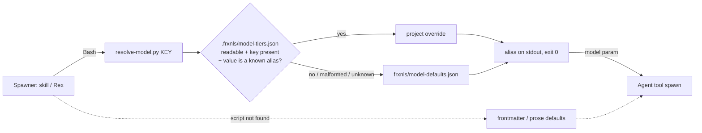

# feat: Install-site model configuration for frxnls agents

## Summary

Replace every hard-coded model assignment in the frxnls plugin with one
canonical defaults map plus a deterministic python3 resolver, overridable per
install site via `.frxnls/model-tiers.json`, and wire **every** frxnls spawn
site (Rex's finder fan-out, all skill dispatches, and the ship-batch workflow)
to pass the resolved model to the Agent tool — with the resolved model visible
in output.

Scope note: the origin doc deferred wiring beyond an MVP slice (map + resolver +
Rex); the user expanded scope during planning to wire all spawners in this plan.

---

## Problem Frame

Model assignments are literals scattered across six locations: `model: sonnet`
in all five agent frontmatters plus Rex's inline per-finder tiers
(`frxnls/agents/rex-code-reviewer.md:237,246,280,301,341` — docs=haiku,
security=opus, others=sonnet). Changing any of them requires a plugin release —
which has already happened (v0.13.0 pinned model IDs; v0.14.0 reverted two days
later). Installed repos have different stakes and budgets and need their own
policy without forking the plugin. (see origin:
docs/brainstorms/2026-07-20-agent-model-config-requirements.md)

---

## Requirements

Carried verbatim from the origin doc (same R-IDs), with R7 now fully in scope.

### Configurability

R1. Every model assignment currently hard-coded in the plugin (five agent
frontmatters; Rex's five finder perspectives) must be changeable in the repo
where the plugin is installed, without a plugin release.

R2. Repo defaults live in **one** canonical defaults map inside the plugin,
replacing the scattered literals as the source of truth. Agent frontmatter
`model:` values remain only as the direct-invocation fallback and must agree
with the map.

R3. The override is a single project-level config file at a stable, documented
path in the installed repo: `.frxnls/model-tiers.json`. No user-level config, no
merge cascade.

R4. Config keys address both whole agents (e.g. `plan-implementer`) and Rex
finder perspectives (e.g. `rex-code-reviewer.security`).

R5. Config values are Claude Code model aliases (`haiku` / `sonnet` / `opus`),
not pinned model IDs.

### Resolution & enforcement

R6. A resolver shipped with the plugin returns the effective model for a key
(project override if set, else repo default) deterministically — callable by
skills and Rex via Bash before each spawn.

R7. Every frxnls spawner passes the resolved model as the Agent tool's `model`
parameter: Rex's finder fan-out, fx-plan's research scouts, fx-compound,
fx-debug, fx-triage, fx-security-audit's verifier, fx-ship's interactive
dispatch, and ship-batch.workflow.js's `agent()` calls.

R8. A repo with no config file (or an unreadable/malformed one, or an unknown
key) behaves exactly as today: repo defaults apply. Malformed config must never
abort a review or build.

### Observability

R9. The resolved model per spawn is visible in output — Rex's summary comment
lists which model each finder actually ran on; other skills state the model when
they spawn an implementer/scout.

---

## Key Technical Decisions

- **Config file at `.frxnls/model-tiers.json`** (user decision): a dedicated
  `.frxnls/` dotdir at the installed repo's root — frxnls-owned namespace, no
  collision with Claude Code's own `.claude/` contents; per-concern files keep
  the schema a flat map with no wrapper object.
- **Flat JSON map, keys = agent name or `rex-code-reviewer.<perspective>`,
  values = aliases**:
  `{"plan-implementer": "opus", "rex-code-reviewer.security": "sonnet"}`. JSON
  parses with python3 stdlib alone — no dependency for a script whose contract
  is "never fail".
- **Perspective key names reuse Rex's existing `reviewer` enum** —
  `simplicity | security | documentation | correctness | data-integrity`
  (`frxnls/agents/rex-code-reviewer.md:212`). One vocabulary; no new terms.
- **Resolver in python3, stdlib only** (user decision): matches the plugin's one
  existing script precedent
  (`frxnls/skills/fx-compound/scripts/validate-frontmatter.py`, invoked via
  `python3` per `fx-compound/SKILL.md:138`). Node isn't guaranteed on non-JS
  install sites; jq is optional tooling; pure-bash JSON parsing is fragile.
- **Canonical defaults map is a standalone JSON file**
  (`frxnls/model-defaults.json`), not constants inside the resolver: the map is
  the _documented source of truth_ humans read and PRs diff; the resolver
  locates it relative to its own file path, so no working-directory assumptions.
- **Never-fail contract**: resolver prints exactly one alias to stdout and
  always exits 0 for resolution calls; warnings (malformed config, unknown key,
  unknown alias value) go to stderr. Spawner prose surfaces stderr warnings but
  proceeds.
- **`--all` batch mode**: one invocation prints the full resolved key→model map
  as JSON. Rex resolves all five finder keys in one Bash call instead of five;
  fx-ship resolves implementer models once and passes them into the batch
  workflow via `args`.
- **Frontmatter fallback is convention-checked, not generated**: a `--check`
  mode compares each `frxnls/agents/*.md` frontmatter `model:` against the
  defaults map and exits non-zero on drift (the one mode allowed to fail — it's
  a lint, not a resolution). No build step is introduced into a pure-markdown
  plugin.
- **Resolver path discovery is a fallback chain** (no `${CLAUDE_PLUGIN_ROOT}`
  precedent exists in the repo): skills use their injected base directory
  (`<skill-base>/../../scripts/resolve-model.py`); Rex — whose agent definition
  gets no base-dir injection — tries `$CLAUDE_PLUGIN_ROOT` if set, then a
  version-sorted glob of the plugin cache, then falls back to the default tiers
  restated in its own prose. Any step failing degrades to defaults, satisfying
  R8.
- **Workflow spawns get models via `args`, not Bash**: workflow scripts can't
  shell out, so fx-ship's SKILL.md resolves the map first (`--all`) and passes
  it as `args.models`; `ship-batch.workflow.js` threads `model:` into its
  `agent()` options from that.

---

## High-Level Technical Design

Resolution flow at every spawn site:



Resolver CLI contract (directional, not exact code):

```
resolve-model.py <key> [--repo-root PATH]   → one alias on stdout, exit 0 always
resolve-model.py --all [--repo-root PATH]   → JSON map of every known key, exit 0 always
resolve-model.py --check                    → lint frontmatter vs defaults map; exit 1 on drift
```

`--repo-root` defaults to the current working directory's git root; the config
is looked up at `<repo-root>/.frxnls/model-tiers.json`.

Canonical key set (defaults map contents, matching today's behavior exactly):

| Key                                | Default |
| ---------------------------------- | ------- |
| `plan-implementer`                 | sonnet  |
| `plan-implementer-backend`         | sonnet  |
| `fx-repo-research`                 | sonnet  |
| `fx-learnings-research`            | sonnet  |
| `rex-code-reviewer`                | sonnet  |
| `rex-code-reviewer.simplicity`     | sonnet  |
| `rex-code-reviewer.security`       | opus    |
| `rex-code-reviewer.documentation`  | haiku   |
| `rex-code-reviewer.correctness`    | sonnet  |
| `rex-code-reviewer.data-integrity` | sonnet  |

---

## Implementation Units

### U1. Canonical defaults map + resolver script

**Goal** — one source of truth for model assignments and a deterministic,
never-failing resolver.

**Requirements** — R2, R3, R4, R5, R6, R8; AE2, AE3, AE4.

**Dependencies** — none.

#### Files

- `frxnls/model-defaults.json` (create)
- `frxnls/scripts/resolve-model.py` (create)
- `frxnls/scripts/test_resolve_model.py` (create — stdlib `unittest`, run via
  `python3 frxnls/scripts/test_resolve_model.py`; the plugin has no test
  harness, so the test file must be self-contained and runnable directly)

**Approach** — Defaults map holds the ten canonical keys above. Resolver:
python3 stdlib only; loads defaults relative to its own file path; overlays
`.frxnls/model-tiers.json` from `--repo-root` (default: git root of cwd) when
present, readable, valid JSON, and per-key when the value is a known alias.
Unknown keys in config are ignored with a stderr warning. `--all` emits the
fully resolved map as JSON. `--check` reads each `frxnls/agents/*.md`
frontmatter `model:` line and compares to the map. Resolution modes always exit
0; only `--check` may exit non-zero.

**Patterns to follow** —
`frxnls/skills/fx-compound/scripts/validate-frontmatter.py` (self-contained
python3 script, regex frontmatter parsing, invoked via Bash).

#### Test scenarios

- No config file → each key resolves to its default; `--all` equals the defaults
  map (AE2).
- Config overrides one key (`rex-code-reviewer.security: sonnet`) → that key
  resolves to `sonnet`, all others to defaults (AE1's resolver half).
- Malformed JSON config → all keys resolve to defaults, warning on stderr, exit
  0 (AE3).
- Config with unknown key (`rex-code-reviewer.styling: haiku`) → ignored with
  stderr warning; known keys resolve normally (AE4).
- Config value not a known alias (`plan-implementer: gpt5`) → that key falls
  back to default with stderr warning.
- Unknown key requested as argument → falls back to `sonnet` with stderr
  warning, exit 0 (a spawner must never be stranded).
- Config file unreadable (permissions) → defaults, exit 0.
- `--check` with agreeing frontmatter → exit 0; with a drifted frontmatter
  `model:` → exit 1 naming the file.

**Verification** — test file passes; running the resolver from an arbitrary cwd
(not the plugin dir) still finds the defaults map; stdout is exactly one alias
(no trailing prose) so command substitution is safe.

### U2. Wire Rex's finder fan-out + summary observability

**Goal** — Rex resolves per-finder models before Stage 3 and reports what each
finder actually ran on.

**Requirements** — R1, R6, R7, R9; AE1.

**Dependencies** — U1.

#### Files

- `frxnls/agents/rex-code-reviewer.md` (modify: Stage 3 preamble, subagent
  headers at lines ~237/246/280/301/341, fan-out table note at ~180, Coverage
  block at ~551-556)

**Approach** — Add a Stage 3 pre-step: locate the resolver via the fallback
chain (`$CLAUDE_PLUGIN_ROOT/scripts/resolve-model.py` if set; else newest match
of `~/.claude/plugins/cache/frxnls/frxnls/*/scripts/resolve-model.py`; else use
the default tiers below) and run it once with `--all`. Replace the literal
`(model: opus)`-style subagent-header tags with "(model: default X — resolved at
spawn)" phrasing and instruct Rex to pass each finder's resolved value as the
Agent tool's `model` parameter on every pass. Rephrase the "keep it at 1 for the
opus finder" cost note (~line 180) to reference the security finder by name, not
by model. Extend the Coverage section of the summary comment with a
`Models: simplicity=sonnet, security=opus, …` line reflecting _resolved_ values,
plus a one-line warning when config was present but malformed. Prose defaults
remain in the agent file as the last-resort fallback (R8) and must agree with
the map (guarded by U1's `--check`).

**Patterns to follow** — Stage 1's existing "resolve state before acting" shape
(`rex-code-reviewer.md:93` fetches prior summary comment before reviewing).

**Test scenarios** — Test expectation: none — prose-driven agent instructions
with no executable surface; behavior is covered by AE1 (manual: config with
`rex-code-reviewer.security: sonnet` → security finder spawned with
`model: sonnet` and Coverage line reports it) and AE3 (malformed config → review
completes on defaults).

**Verification** — a full Rex run in a repo with an override shows the override
in the Coverage `Models:` line; a run with no config behaves identically to
today; `--check` passes against the updated file.

### U3. Wire skill spawn sites (scouts and verifiers)

**Goal** — every prose-driven Agent dispatch in the skills resolves and passes
`model`, and states it when spawning.

**Requirements** — R1, R6, R7, R9.

**Dependencies** — U1.

#### Files

- `frxnls/skills/fx-plan/SKILL.md` (modify: research dispatch at ~126-133)
- `frxnls/skills/fx-compound/SKILL.md` (modify: parallel dispatch at ~107-115)
- `frxnls/skills/fx-debug/SKILL.md` (modify: ~95-97)
- `frxnls/skills/fx-triage/SKILL.md` (modify: ~95-97)
- `frxnls/skills/fx-security-audit/SKILL.md` (modify: verifier at ~109)

**Approach** — Insert one standard short paragraph per dispatch site (same
wording everywhere, so future greps find every instance): resolve via
`python3 "<skill-base>/../../scripts/resolve-model.py" <agent-name>` (skills
know their injected base directory), pass the result as the Agent tool's `model`
parameter, and mention the model in the one-line announcement the skill already
makes when dispatching. If the resolver is missing or errors, omit the `model`
parameter entirely — the agent frontmatter default applies (R8). Ad-hoc/general-
purpose dispatches without a canonical key (fx-plan's web-search agent,
fx-debug's hypothesis sub-agents, fx-security-audit's verifier) are left unkeyed
— omitting `model` inherits the session default, which is today's behavior; do
not invent keys for them.

**Patterns to follow** — `fx-compound/SKILL.md:138`'s existing relative-path
script invocation.

**Test scenarios** — Test expectation: none — prose instruction edits with no
executable surface; covered by the resolver tests (U1) and spot-checked by
running one skill and observing the announced model.

**Verification** — grep for the standard resolver-invocation phrase returns all
five skill files; each named-agent dispatch site mentions passing `model`; no
dispatch site still implies a hard-coded model.

### U4. Wire fx-ship (interactive + batch workflow)

**Goal** — implementer spawns in both fx-ship paths use resolved models.

**Requirements** — R1, R6, R7, R9.

**Dependencies** — U1.

#### Files

- `frxnls/skills/fx-ship/SKILL.md` (modify: interactive dispatch at ~47-52;
  batch-invocation instructions at ~69)
- `frxnls/skills/fx-ship/ship-batch.workflow.js` (modify: `agent()` calls at
  ~60-72 and ~74-82)

**Approach** — Interactive path: same standard paragraph as U3, resolving
`plan-implementer` or `plan-implementer-backend` per the routing decision. Batch
path: workflow scripts cannot shell out, so SKILL.md's batch instructions gain a
step — run the resolver with `--all` and pass the result into the Workflow tool
as `args.models` alongside the existing items. In `ship-batch.workflow.js`, the
implement-stage `agent()` call adds `model: (args.models || {})[implementerKey]`
(undefined → the Workflow runtime inherits the session default, preserving R8);
the prepare-stage classifier call stays unkeyed. The workflow's completion
`log()` line mentions the models used (R9).

**Patterns to follow** — the workflow already threads per-run data via `args`
(`ship-batch.workflow.js` reads `args` for items); `agentType` selection at line
79 shows the implementer-key shape to mirror.

**Test scenarios** — Test expectation: none — the workflow change is a
pass-through of an `args` value into an `agent()` option, with no independently
runnable harness for workflow scripts in this repo; guard rails are the
`|| {}`-style defaulting (missing `args.models` must not throw) and AE2
behavior.

**Verification** — batch run with no config behaves as today (no `model` key
passed); with an override, the implement-stage agent receives it and the final
log names the models.

### U5. Frontmatter agreement, docs, examples, release

**Goal** — the install-site contract is documented, exemplified with two real
config files, drift-guarded, and released.

**Requirements** — R2, R3, R9 (documentation of the observability contract).

**Dependencies** — U1-U4.

#### Files

- `frxnls/agents/plan-implementer.md`,
  `frxnls/agents/plan-implementer-backend.md`,
  `frxnls/agents/fx-repo-research.md`, `frxnls/agents/fx-learnings-research.md`,
  `frxnls/agents/rex-code-reviewer.md` (verify frontmatter `model:` agreement
  via `--check`; values are already all `sonnet` and the map matches — expected
  no-op)
- `README.md` (modify: new "Model configuration" section — file path, key table,
  alias values, fallback semantics)
- `SETUP.md` (modify: one note — Rex CI reads `.frxnls/model-tiers.json` from
  the reviewed repo's checkout; no bot-side setup needed)
- `examples/model-tiers.high-stakes.json` (create)
- `examples/model-tiers.side-project.json` (create)
- `CHANGELOG.md` (modify: entry under `[Unreleased]` → v0.19.0)
- `frxnls/.claude-plugin/plugin.json` (modify: version bump to 0.19.0)

**Approach** — The two example configs discharge the origin's "hand-write
configs for two real repos" question and must differ (that difference is the
evidence for the project-level premise): high-stakes (Forked Up-shaped) bumps
`plan-implementer-backend: opus` and keeps `rex-code-reviewer.security: opus`;
side-project downgrades `rex-code-reviewer.security: sonnet` and scouts to
`haiku`. README documents: the full key table, that partial configs are normal
(set only what you override), and the never-fail fallback story in one
paragraph. Release follows the repo's Keep-a-Changelog convention.

**Patterns to follow** — `CHANGELOG.md` existing entry format; README's existing
component-table style.

**Test scenarios** — Test expectation: none — docs, examples, and release
metadata. `--check` (from U1) is the executable guard and must pass.

**Verification** — `--check` exits 0; both example files parse via the resolver
against a scratch repo root and produce the intended overrides; README section
names the exact path `.frxnls/model-tiers.json` and all ten keys.

---

## Acceptance Examples

Carried from the origin doc.

AE1. **Covers R6, R7.** Given a project config setting
`rex-code-reviewer.security: sonnet`, when Rex runs a full review in that repo,
then the security finder is spawned with `model: sonnet` and the summary comment
reports it.

AE2. **Covers R8.** Given no config file in the repo, when any frxnls skill
spawns an agent, then the model matches today's behavior (defaults map) exactly.

AE3. **Covers R8.** Given a config file with invalid JSON, when Rex runs, then
the review completes on repo defaults (a warning may be surfaced, but never a
failure).

AE4. **Covers R4, R8.** Given a config containing an unknown key
(`rex-code-reviewer.styling: haiku`), when the resolver runs, then the unknown
key is ignored and all known keys resolve normally.

---

## Scope Boundaries

Out of scope, carried from the origin doc: per-invocation complexity routing;
tier indirection (`simple/medium/complex` vocabularies — the aliases are the
tiers); user-level config or precedence chains; config validation tooling beyond
`--check`, schema versioning, env-var overrides.

Additionally out of scope here: Rex's fan-out dials (partitions ×
rolls/partition) live beside the model tiers in the same file section and are
**not** made configurable — models only (flagged as a scope-creep risk by
research; resist it).

### Deferred to Follow-Up Work

- Making fan-out counts (partitions/rolls) install-site configurable, if ever
  wanted — same file, same pattern, separate decision.
- A CI job that runs `--check` and the resolver tests automatically (the repo
  has no CI for plugin content today; introducing CI is its own change).

---

## Risks & Dependencies

- **Rex's resolver discovery in CI.** Rex runs as a GitHub App in CI (SETUP.md);
  whether `$CLAUDE_PLUGIN_ROOT` is set, and what the plugin cache path looks
  like there, is an execution-time unknown. The fallback chain (env var → cache
  glob → prose defaults) means the worst case is today's behavior, never a
  failure. Implementer should verify which chain step fires in a real CI run and
  tighten the prose to match.
- **Skill base-dir relative path.** U3 relies on the injected skill base
  directory resolving `../../scripts/resolve-model.py` inside the installed
  plugin tree. This holds for the standard plugin cache layout; if a step fails,
  the omit-`model` fallback applies. Verify once during implementation.
- **Alias drift.** If Claude Code ever renames the `haiku/sonnet/opus` aliases,
  configs degrade to defaults (unknown-alias guard) rather than breaking —
  acceptable by design, but worth a README sentence.
- **Prose duplication of defaults in Rex.** Rex's last-resort prose defaults can
  drift from `model-defaults.json`; `--check` guards frontmatter but not prose.
  Keep the prose fallback to a single compact table adjacent to the Stage 3
  pre-step so drift is visible in any diff touching either.

---

## Sources / Research

- Current literals: `frxnls/agents/*.md:5` (five frontmatters);
  `frxnls/agents/rex-code-reviewer.md:237,246,280,301,341` (finder tiers);
  fan-out cost note referencing a model by name at `rex-code-reviewer.md:180`.
- Spawn-site inventory (11 sites): `fx-plan/SKILL.md:126-133,145-146`;
  `fx-compound/SKILL.md:107-115`; `fx-debug/SKILL.md:95-97,305-308`;
  `fx-triage/SKILL.md:95-97`; `fx-security-audit/SKILL.md:109`;
  `fx-ship/SKILL.md:47-52`; `fx-ship/ship-batch.workflow.js:60-82`; Rex Stage 3
  `rex-code-reviewer.md:161-206`.
- Script precedent: `frxnls/skills/fx-compound/scripts/validate-frontmatter.py`,
  invoked at `fx-compound/SKILL.md:138`. No `${CLAUDE_PLUGIN_ROOT}` usage exists
  in the repo.
- Reviewer-name enum reused for perspective keys: `rex-code-reviewer.md:212`.
- Summary-comment Coverage block (R9 landing zone):
  `rex-code-reviewer.md:551-556`.
- Model-pinning flip-flop precedent for R5: commits `641c557` (v0.13.0 pin),
  `0ff9c45` (v0.14.0 revert); `CHANGELOG.md:53-77`.
- Prior art: everyinc/compound-engineering-plugin YAML model routing —
  install-site config adopted; dynamic complexity routing rejected (see origin).
